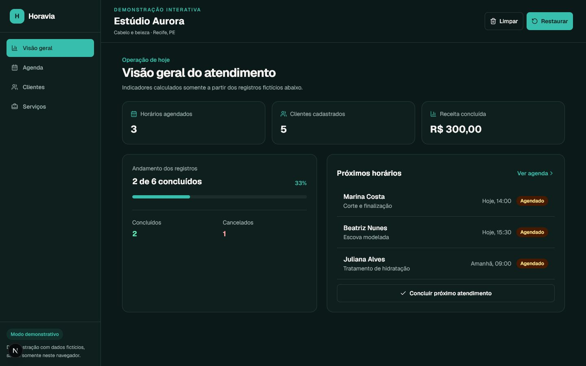
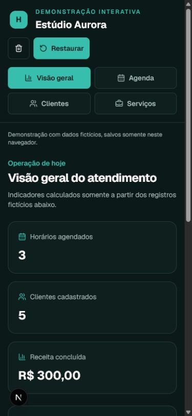

# Horavia

**Do primeiro horário ao último atendimento.**

Horavia é uma demonstração de produto para organização de agenda, clientes e serviços em pequenos negócios de atendimento. A experiência pública usa o Estúdio Aurora, um negócio fictício de cabelo e beleza, para apresentar um fluxo coerente sem exigir cadastro ou credenciais externas.

- **Demonstração:** [https://horavia.vercel.app/demo](https://horavia.vercel.app/demo)
- **Repositório:** [https://github.com/LipDev-sudo/horavia](https://github.com/LipDev-sudo/horavia)

> Projeto demonstrativo de portfólio. Os nomes, contatos, horários e valores exibidos são fictícios e não representam clientes ou resultados comerciais reais.

## Demonstração interativa

Execute o projeto e acesse [`/demo`](http://localhost:3000/demo). A demonstração:

- funciona sem conta, Supabase ou Stripe;
- reúne visão geral, agenda, clientes e serviços;
- calcula indicadores apenas a partir dos registros fictícios;
- salva alterações somente no navegador, em `horavia-demo-v1`;
- permite concluir o próximo atendimento, limpar os dados e restaurar o cenário inicial;
- apresenta estados vazios e recuperação de dados.



<details>
<summary>Visualização mobile</summary>



</details>

## Competências demonstradas

- arquitetura Next.js 16 com App Router e React 19;
- TypeScript, Tailwind CSS 4 e componentes responsivos;
- autenticação, Postgres e Row Level Security com Supabase;
- CRUD protegido de clientes, serviços e atendimentos;
- Stripe Checkout e webhook assinado em modo de teste;
- estado local validado com Zod para uma demo independente;
- testes unitários com Vitest e CI no GitHub Actions;
- metadata, Open Graph, sitemap, robots e acessibilidade.

## Execução local

```bash
git clone https://github.com/LipDev-sudo/horavia.git
cd horavia
npm ci
npm run dev
```

A landing page e a rota `/demo` funcionam sem variáveis de ambiente.

Para testar autenticação, persistência e cobrança, copie o modelo e adicione suas próprias credenciais de teste:

```bash
cp .env.example .env.local
```

Depois, execute [`supabase/schema.sql`](supabase/schema.sql) no SQL Editor do Supabase.

| Variável | Exposição | Finalidade |
| --- | --- | --- |
| `NEXT_PUBLIC_SUPABASE_URL` | Navegador | URL do projeto Supabase |
| `NEXT_PUBLIC_SUPABASE_PUBLISHABLE_KEY` | Navegador | Chave pública do Supabase |
| `SUPABASE_SECRET_KEY` | Servidor | Operações administrativas do webhook |
| `NEXT_PUBLIC_STRIPE_PUBLISHABLE_KEY` | Navegador | Chave pública de teste da Stripe |
| `STRIPE_SECRET_KEY` | Servidor | Sessões de checkout |
| `STRIPE_WEBHOOK_SECRET` | Servidor | Validação da assinatura do webhook |
| `NEXT_PUBLIC_APP_URL` | Público | URL base de redirects e metadata |

Nunca versione `.env.local`. O webhook rejeita requisições sem assinatura e chaves de servidor não devem usar o prefixo `NEXT_PUBLIC_`.

## Qualidade

```bash
npm test
npm run typecheck
npm run lint
npm run build
npm audit
```

O GitHub Actions executa instalação limpa, testes, typecheck, lint e build em pushes e Pull Requests.

## Estrutura principal

```text
src/app/demo/              demonstração pública local
src/app/dashboard/         aplicação autenticada
src/app/api/stripe/        checkout e webhook
src/components/demo/       interface modular da demonstração
src/lib/demo-data.ts       estado e registros fictícios validados
src/lib/supabase/          clientes de navegador, servidor e proxy
supabase/schema.sql        schema e políticas RLS
```

Desenvolvido por [LipDev](https://lipdev.vercel.app).
