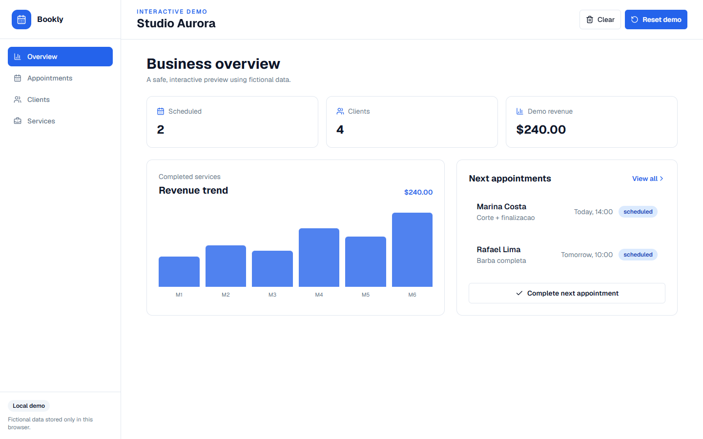
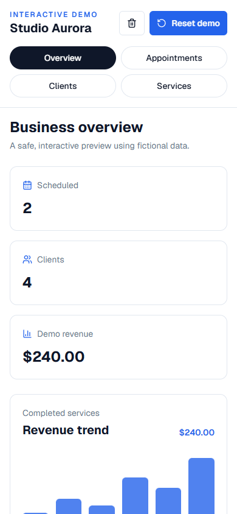

# Bookly

Scheduling and client management application for small service businesses. The project combines a public, credential-free demonstration with an authenticated Supabase application and optional Stripe test-mode billing.

## Interactive demo

Run the project and open [`/demo`](http://localhost:3000/demo). The demo:

- requires no account, Supabase project or Stripe key;
- uses fictional records only;
- stores changes in the browser under `bookly-demo-v1`;
- includes overview, appointments, clients and services;
- can be cleared and restored to demonstrate empty states.



<details>
<summary>Mobile preview</summary>



</details>

## Technology

- Next.js 16 App Router and React 19
- TypeScript and Tailwind CSS 4
- Supabase Auth, Postgres and Row Level Security
- Stripe Checkout and signed webhooks in test mode
- React Hook Form, Zod and Recharts

## Local setup

```bash
npm ci
npm run dev
```

The landing page and `/demo` work without environment variables.

To use authentication, persistent database records and billing, copy the template and provide your own test credentials:

```bash
cp .env.example .env.local
```

Then execute [`supabase/schema.sql`](supabase/schema.sql) in the Supabase SQL Editor.

| Variable | Visibility | Purpose |
| --- | --- | --- |
| `NEXT_PUBLIC_SUPABASE_URL` | Browser-safe | Supabase project URL |
| `NEXT_PUBLIC_SUPABASE_PUBLISHABLE_KEY` | Browser-safe | Public Supabase client key |
| `SUPABASE_SECRET_KEY` | Server only | Administrative webhook operations |
| `NEXT_PUBLIC_STRIPE_PUBLISHABLE_KEY` | Browser-safe | Stripe.js test-mode key |
| `STRIPE_SECRET_KEY` | Server only | Checkout sessions |
| `STRIPE_WEBHOOK_SECRET` | Server only | Webhook signature verification |
| `NEXT_PUBLIC_APP_URL` | Public | Redirect base URL |

Never commit `.env.local`. The Stripe webhook rejects unsigned requests, and server-only keys must not use the `NEXT_PUBLIC_` prefix.

## Commands

```bash
npm run lint
npm run typecheck
npm run build
```

The repository currently has no automated test suite. GitHub Actions runs installation, lint, typecheck and production build for pull requests.

## Application areas

- Public landing page and local interactive demo
- Email/password authentication with Supabase
- Protected dashboard overview
- Clients, services and appointments CRUD
- Revenue chart based on completed appointments
- Stripe test-mode subscription checkout and signed webhook handling

## Project structure

```text
src/app/demo/              public local demo
src/app/dashboard/         authenticated application
src/app/api/stripe/        checkout and webhook routes
src/components/            shared UI and demo dashboard
src/lib/supabase/          browser, server and proxy clients
src/lib/demo-data.ts       fictional demo records
supabase/schema.sql        database schema and RLS policies
```

Built by [LipDev](https://lipdev.vercel.app).
